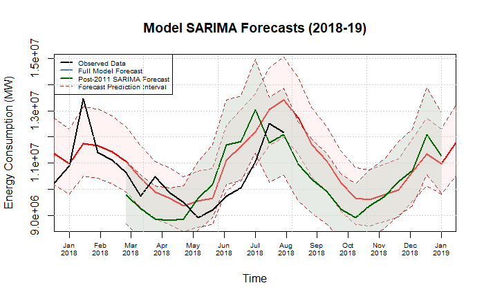
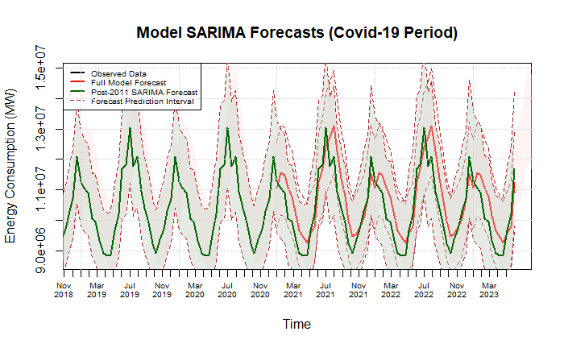

# Energy Consumption Time-Series Analysis

This repository contains a time-series analysis of PJM Interconnection LLC's hourly energy consumption data (2002-2018). The project explores long-term and short-term trends, seasonal patterns, and forecasting performance using SARIMA models. Key findings include structural changes post-2011, likely due to policy shifts like renewable energy adoption.

## Key Features
- **Trend Analysis**: 
  - **Long-term (2002-2018)**: Captures broad seasonal patterns.  
  - **Short-term (post-2011)**: Better reflects recent consumption shifts.  
- **Forecasting**: Hybrid weighted model (45% long-term, 55% short-term) predicts COVID-19 period demand.  
- **Performance**:  
  - **R²**: 0.681 (long-term), 0.778 (short-term).  
  - Lower MAE/RMSE for post-2011 model.  

## Results
  
*Weighted SARIMA forecast on full biweekly data (2018–2019).*  

  
*Covid Forecast.*  

## Usage
Refer to the full report (`Report.pdf`) for detailed methodology, code, and analysis.  

## Further Work
- Hyperparameter tuning (GridSearchCV).  
- Quarterly trend analysis for seasonal drift.  
- Incorporate environmental factors (e.g., global warming).  
